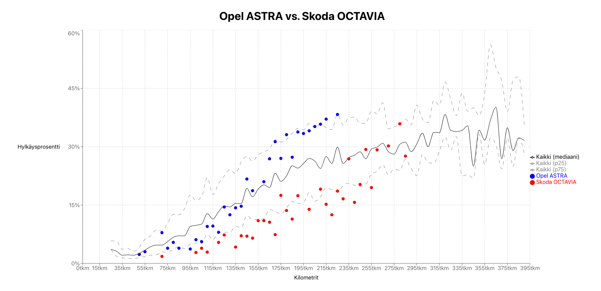

# Katsastustilastot

https://marcholio.github.io/katsastustilastot

Cars are source for an endless debate about reliability of different brands and models.
One says that Opel is always having issue, someone else thinks that's actually BMW.

But what does the data have to say about the matter? Which car is the best if you are looking for
a reliability over hundreds of thousands of kilometers? This service helps you
compare different car brands and models over time based on [Trafi's inspection statistics](https://trafi2.stat.fi/PXWeb/pxweb/fi/TraFi/TraFi__Katsastuksen_vikatilastot/?tablelist=true).
It might not end the discussions, but at least it gives some hard facts to discuss about.

## Data

The data includes Trafi's inspection statistics for 2017 - 2022, limited to cars that are less
than 15 years old at the time of inspection. The source data includes car's model, inspection year,
average kilometers, number of cars inspected and number of failed cars that did not pass the inspection.

The data has been analyzed and visualized for easy comparison between different cars models.

For example a comparison of Opel Astra and Skoda Octavia over different manufacturing years and inspection years
looks like this:

The average of all cars in the data is plotted with a grey line, together with 25th and 75th percentiles,
which gives and outline on how different cars compare to other cars on average. For example in the image above
Opel Astra is better than average until about 140k km, but after that it starts to have issues.
